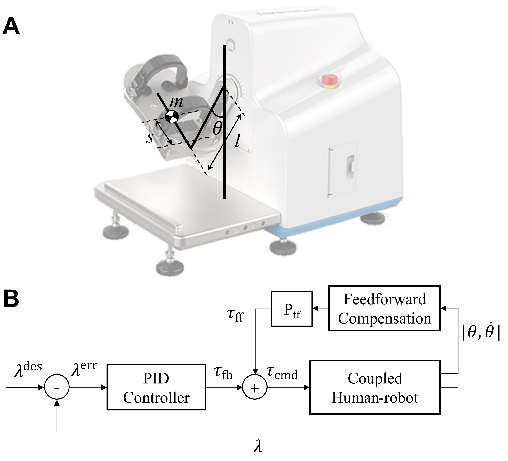

# Hardware Testing - AnkleMotus M1 Ankle Robot

This page introduces the M1DemoMachine and M1ROSDemoMachine, two example CORC apps showing the basic use of the M1 ankle rehabilitation robot.

The M1 is a one DoF admittance based robot developed by Fourier Intelligence:


AnkleMotus M1 and torque control framework.

The state machine code can be found in the folder `src/apps/M1DemoMachine`.

It demonstrates the use of:
- The different control modes of M1 (position, velocity, or torque)
- The use of the force measurements

The state machine code can be found in the folder `src/apps/M1ROSDemoMachine`.

It demonstrates the use of:
- The different control modes of M1 in ROS system (position, velocity, or torque)
- The use of the force measurements

## Setup instruction

It is assumed that an Ubuntu PC is used and ROS is installed. If this is not the case for you, please visit [here](InstallLinux.md) and [here](InstallROS.md).

If not already installed, install ros_control:
```bash
$ sudo apt-get install ros-<melodic or noetic>-ros-control ros-<melodic or noetic>-ros-controllers
```

Create a catkin workspace if you don't have one yet:
```bash
$ mkdir -p ~/catkin_ws/src
$ cd ~/catkin_ws/
$ catkin build
```

Clone CORC and the required packages into your workspace:
```bash
$ cd ~/catkin_ws/src
$ git clone --recurse-submodules https://github.com/UniMelbHumanRoboticsLab/CANOpenRobotController.git
```

## Build and run M1DemoMachine

Configure the CMakeList.txt, select the M1DemoMachine, and set the flags for using a real robot without ROS support:

```cmake
#set (STATE_MACHINE_NAME "ExoTestMachine")
set (STATE_MACHINE_NAME "M1DemoMachine")
#set (STATE_MACHINE_NAME "M2DemoMachine")
#set (STATE_MACHINE_NAME "M3DemoMachine")
#set (STATE_MACHINE_NAME "X2DemoMachine")
#set (STATE_MACHINE_NAME "LoggingDevice")
# Comment to use actual hardware, uncomment for a nor robot (virtual) app
set(NO_ROBOT OFF)
# ROS Flag. set ON if you want to use ROS. Else, set OFF.
set(USE_ROS OFF)
```

Build CORC:
```bash
$ cd ~/catkin_ws
$ catkin build CORC
$ source devel/setup.bash
```

Initialize the CAN device (No need to repeat this step, unless you restart your PC):

```bash
$  cd script
$  ./initCAN0.sh
```

Run the compiled executable file:
```bash
$ cd ~/catkin_ws
$ sudo ./build/CORC/M1DemoMachine_APP
```

Use keyboard to explore different controllers:
- Key S: start zeroing/calibration
- Key X: start monitoring torque reading
- Key A: position, velocity, and torque controller demonstrations
- Key Q: return to idle state

## Build and run M1ROSDemoMachine (To be tested)

Configure the CMakeList.txt, select the M1DemoMachine, and set the flags for using a real robot without ROS support:

```cmake
#set (STATE_MACHINE_NAME "ExoTestMachine")
#set (STATE_MACHINE_NAME "M1DemoMachine")
#set (STATE_MACHINE_NAME "M2DemoMachine")
#set (STATE_MACHINE_NAME "M3DemoMachine")
#set (STATE_MACHINE_NAME "X2DemoMachine")
set (STATE_MACHINE_NAME "M1ROSDemoMachine")
#set (STATE_MACHINE_NAME "LoggingDevice")
# Comment to use actual hardware, uncomment for a nor robot (virtual) app
set(NO_ROBOT OFF)
# ROS Flag. set ON if you want to use ROS. Else, set OFF.
set(USE_ROS ON)
```

Build CORC:
```bash
$ cd ~/catkin_ws
$ catkin build CORC
$ source devel/setup.bash
```

Initialize the CAN device (No need to repeat this step, unless you restart your PC):

```bash
$  cd script
$  ./initCAN0.sh
```

Run the compiled executable file:
```bash
$ cd ~/catkin_ws
$ roslaunch CORC m1_real.launch
```